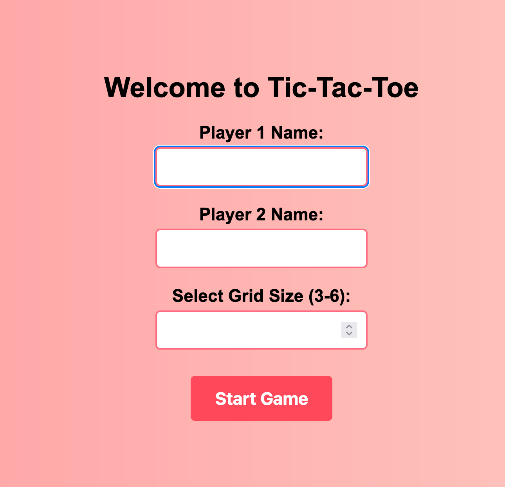
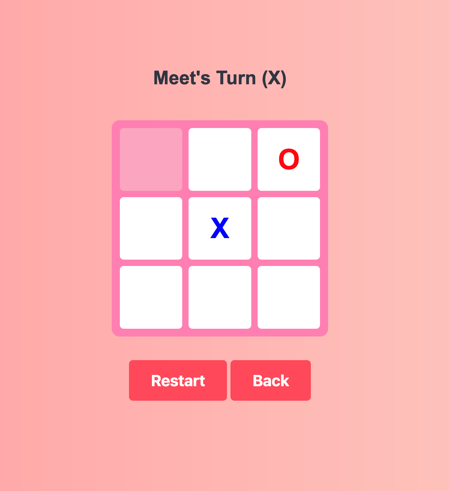
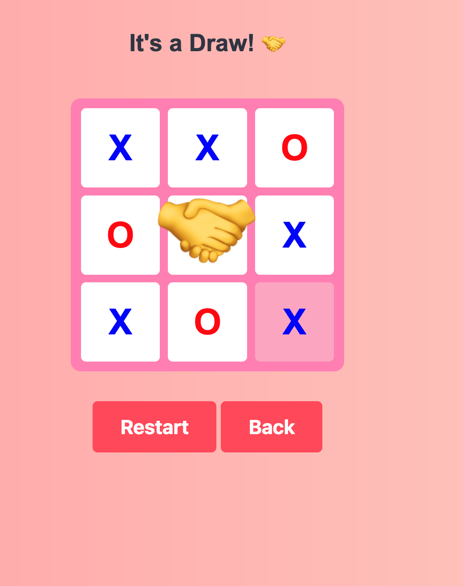

# TicTacToe
An App for a game of Tic-Tac-Toe

## Sample Screenshots








## Android APP

* Users can also create an Android APP if needed

* The Android app will have all the features that the desktop App has

## Technologies & Frameworks User

* **Flask:** A micro web framework written in Python, used for handling backend logic, routing, and server-side operations.

* **JavaScript:** Utilized for creating dynamic content on the client side.

* **Python:** The core programming language used for server-side logic and interaction with the database.

* **HTML & CSS:** Used for structuring and styling the web application's interface, ensuring a responsive and intuitive design.

* **Buildozer:** Used for creating Android APP

## Getting Started

* To run the Invests Growth Projector App on your local machine, follow these steps:

1. **Clone the Repository:** Clone the project to your local machine.
```bash
git clone https://github.com/meet1993shah/TicTacToe.git
cd TicTacToe
```

2. **Install Dependencies:** Install the required Python packages
```bash
pip3 install -r requirements.txt
```

3. **Run the Application:** Start the Flask application
```bash
python3 main.py
```

4. **Access the App:** Open your web browser and navigate to `http://127.0.0.1:8080/` to start using the App.

## Creating Android APP

* I'm assuming you've already performed the steps mentioned in Getting Started Section

1. **Install Buildozer:** Install Buildozer
```bash
pip3 install --user --upgrade buildozer
```

2. **Connect Android Device:** Connect your android device to the local machine, you can check if the device is connected or not by the following bash commands
```bash
adb devices
# If the service needs to start
adb start-server
adb --help
```

3. **Update Buildozer Spec:** If needed you can change the spec info in buildozer.spec file

4. **Run Buildozer:** Run Buildozer
```bash
buildozer -v android debug deploy run logcat > app_log.txt
```
* this will take a long time to build on the first run, on successful completion you'll find the apk file in bin/ folder
* this will also create a app_log.txt file for debugging and logging
* the apk will automatically be installed on your Android Device on success

## Contributing

Contributions to the Investments Growth Projector App are welcome! Whether it's bug reports, feature requests, or code contributions, please feel free to reach out or submit a pull request.
